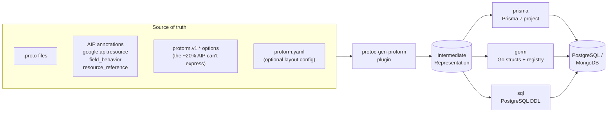
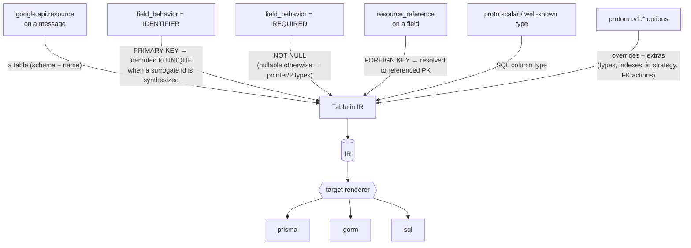
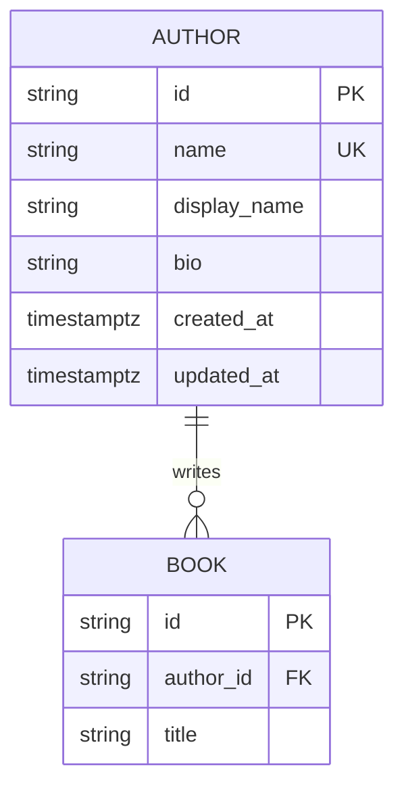
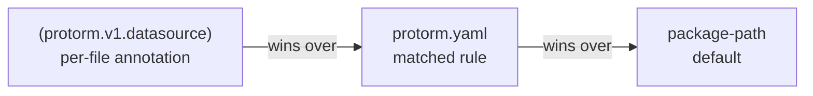

# protorm

> **Protobuf → Database** — generate production-grade Prisma, GORM, and PostgreSQL
> schemas directly from the [Google AIP](https://google.aip.dev/) annotations you
> already use. One source of truth, three backends that always agree.

[](https://github.com/the-protobuf-project/protorm/releases)
[](https://pkg.go.dev/github.com/the-protobuf-project/protorm)
[](go.mod)
[](https://buf.build/the-protobuf-project/protorm)
[](https://github.com/the-protobuf-project/protorm/actions/workflows/test.yaml)
[](LICENSE)

> [!CAUTION]
> Early development — the API and generated output may change between versions.
> Pin a release tag in CI and review the diff before applying a migration.

## Contents

- [Overview](#overview)
- [Features](#features)
- [Architecture](#architecture)
- [How it works](#how-it-works)
- [Install](#install)
- [Quick start](#quick-start)
- [Output layout](#output-layout)
- [Annotations reference](#annotations-reference)
- [Configuration — `protorm.yaml`](#configuration--protormyaml)
- [Plugin options](#plugin-options)
- [Defaults applied automatically](#defaults-applied-automatically)
- [Determinism & migrations](#determinism--migrations)
- [Type mapping](#type-mapping)
- [Examples](#examples)
- [Building from source](#building-from-source)
- [Releases & versioning](#releases--versioning)
- [License](#license)

## Overview

**protorm** is a [protoc](https://protobuf.dev/) plugin (`protoc-gen-protorm`) that
turns Protobuf service definitions into database schemas. Annotate your messages
with the [Google AIP](https://google.aip.dev/) standards you already use
(`google.api.resource`, `field_behavior`, `resource_reference`) and protorm infers
tables, columns, primary keys, foreign keys, and relations — then emits them for
three backends from one source of truth.

| Target | Output | Notes |
| --- | --- | --- |
| **prisma** | A complete, runnable Prisma 7 project | multi-file schema, `package.json`, `tsconfig.json`, config, `.env.example` |
| **gorm** | Go structs with GORM tags + a migration registry | one package per schema, pointer types for nullables, relation fields, a `migrate.go` factory `Registry`; optional [per-resource CRUD stores and OpenTelemetry tracing](#gorm-stores-and-tracing) |
| **sql** | PostgreSQL DDL | per-schema reference files **and** a single transactional, **idempotent** `migrate.sql` (safe to re-apply); FK constraints, indexes, `updated_at` triggers, `COMMENT ON` |

Every target also emits a `README.md` with a Mermaid ER diagram and a per-model
column reference, so the generated tree is self-documenting regardless of backend.
Postgres and MongoDB providers are both supported.

## Features

- **AIP-native.** ~80% of the schema is read straight from standard AIP
  annotations; only the remaining ~20% needs `protorm.v1.*` options.
- **Three backends, one IR.** A single intermediate representation renders to
  Prisma, GORM, and SQL — so all three outputs always agree.
- **Production defaults.** ULID surrogate keys, auto-managed timestamps,
  FK indexing, soft-delete markers, and enum hygiene — all overridable.
- **Idempotent SQL.** The consolidated `migrate.sql` is transactional and guarded
  (`IF NOT EXISTS`, `CREATE OR REPLACE`, deferred FK `ALTER`s) — safe to re-apply.
- **Relational nesting.** Nested and imported value messages become real child
  tables (PK + FK), never opaque `JSONB` blobs — your structure stays queryable.
- **Monorepo layout.** An optional [`protorm.yaml`](#configuration--protormyaml)
  maps proto packages to databases and schemas without per-file annotations.
- **Deterministic.** Re-running on unchanged protos produces byte-identical
  output (enforced by golden tests), so regenerate → `migrate diff` is a no-op.
- **Self-documenting.** Each target ships a `README.md` with a Mermaid ER diagram.

## Architecture



protorm builds everything into one IR, then each target renders it independently.
Files that declare the **same datasource name merge into one database**, so a
multi-file proto package becomes a single schema tree.

## How it works

Every annotation maps to a concrete piece of schema. protorm collects them all
into the IR, applies its [production defaults](#defaults-applied-automatically),
then hands the IR to the selected renderer.



| Source annotation | Inferred output |
| --- | --- |
| `google.api.resource` on a message | a table; schema + name from `type` / `plural` |
| `field_behavior = IDENTIFIER` | `PRIMARY KEY NOT NULL` |
| `field_behavior = REQUIRED` | `NOT NULL` (nullable otherwise → pointer/`?` types) |
| `resource_reference` on a field | a `FOREIGN KEY`, resolved to the referenced PK |
| proto scalar / well-known type | the column's SQL type (see [Type mapping](#type-mapping)) |

## Install

```bash
# Homebrew (macOS / Linux)
brew install the-protobuf-project/tap/protoc-gen-protorm

# or go install
go install github.com/the-protobuf-project/protorm/plugin/cmd/protoc-gen-protorm@latest
```

Releases ship prebuilt binaries for **linux / darwin / windows** on **amd64 / arm64**
on the [Releases page](https://github.com/the-protobuf-project/protorm/releases).
The plugin must be on your `PATH` so `protoc`/`buf` can find it.

You'll also need the option definitions on your import path. With
[buf](https://buf.build), add the module to your `buf.yaml` `deps`:

```yaml
deps:
  - buf.build/the-protobuf-project/protorm
```

then `import "protorm/v1/annotations.proto";` in your protos.

## Quick start

**1. Annotate a proto.**

```proto
syntax = "proto3";
package bookstore.v1;

import "google/api/field_behavior.proto";
import "google/api/resource.proto";
import "protorm/v1/annotations.proto";

option (protorm.v1.datasource) = {
  database: "bookstore_db"
  provider: "postgres"
};

message Author {
  option (google.api.resource) = {
    type: "bookstore.v1/Author"
    pattern: "authors/{author}"
    singular: "author"
    plural: "authors"
  };
  // Use a generated ULID primary key + created_at/updated_at columns.
  option (protorm.v1.table) = { id: ID_STRATEGY_ULID, timestamps: true };

  // IDENTIFIER → the AIP resource name; becomes a UNIQUE lookup column.
  string name = 1 [(google.api.field_behavior) = IDENTIFIER];

  // REQUIRED → NOT NULL; string defaults to VARCHAR(255).
  string display_name = 2 [(google.api.field_behavior) = REQUIRED];

  // Override the default for a free-form column.
  string bio = 3 [(protorm.v1.column) = { type: "TEXT" }];
}
```

**2. Add the plugin to `buf.gen.yaml`.**

```yaml
version: v2
plugins:
  - local: protoc-gen-protorm
    out: generated/prisma
    opt: [target=prisma]   # prisma | gorm | sql
```

**3. Generate.**

```bash
buf generate
```

> [!NOTE]
> protorm doesn't generate Go message stubs, so protoc/buf needs a Go import
> path for each file. If your protos don't set `option go_package`, supply it
> per file in `opt:` with an `M` mapping, e.g.
> `Mbookstore/v1/bookstore.proto=example.com/gen/bookstore/v1`.

### What comes out

The `Author` message above produces, across targets — **Prisma:**

```prisma
model Author {
  id          String   @id @default(ulid()) @map("id")
  name        String   @unique @map("name")
  displayName String   @map("display_name")
  bio         String?  @map("bio")
  createdAt   DateTime @default(now()) @map("created_at")
  updatedAt   DateTime @updatedAt @map("updated_at")
  books       Book[]

  @@map("authors")
  @@schema("bookstore_v1")
}
```

**GORM:**

```go
type Author struct {
  ID          string    `gorm:"column:id;primaryKey;not null"`
  Name        string    `gorm:"column:name;not null;uniqueIndex"`
  DisplayName string    `gorm:"column:display_name;not null"`
  Bio         *string   `gorm:"column:bio"`
  CreatedAt   time.Time `gorm:"column:created_at;autoCreateTime"`
  UpdatedAt   time.Time `gorm:"column:updated_at;autoUpdateTime"`
  Books       []Book    `gorm:"foreignKey:AuthorID"`
}

func (*Author) TableName() string { return "bookstore_v1.authors" }
```

(`///` doc comments and `json`/`validate` tags are emitted too — trimmed here for space.)

And every target also drops a `README.md` with the relationships drawn out, e.g.:



## Output layout

Files that declare the **same datasource name merge into one database**, so a
multi-file proto package becomes a single schema tree. Each target lays its
output out to match:

```text
generated/prisma/bookstore_db/
├── schema.prisma                          # datasource + generator blocks
├── bookstore_db.config.ts                 # Prisma 7 config (URL via env)
├── package.json, tsconfig.json            # runnable project scaffold
├── .env.example, .gitignore, README.md
├── bookstore_v1/bookstore.postgres.prisma # models & enums, one file per source proto
└── inventory/inventory.postgres.prisma    # (a second file, merged datasource)

generated/gorm/bookstore_db/bookstorev1/models.go        # package = folder name
generated/gorm/bookstore_db/bookstorev1/author_store.go  # typed CRUD store (stores opt)
generated/gorm/gormx/gormx.go                       # shared runtime: ListOptions, Store[M], engine (stores opt)
generated/gorm/bookstore_db/migrate.go              # factory Registry + EnsureSchemas + Instrument (needs go_module)
generated/gorm/bookstore_db/README.md               # ER diagram + model reference
generated/sql/bookstore_db/migrate.sql              # whole DB, one transactional file
generated/sql/bookstore_db/bookstore_v1.postgres.sql
generated/sql/bookstore_db/README.md
```

The Prisma output is a project you can run immediately:

```bash
cd generated/prisma/bookstore_db
npm install
cp .env.example .env        # then set BOOKSTORE_DB_DATABASE_URL
npm run prisma:generate
```

The **gorm** target emits a `migrate.go` factory registry (when you pass the
`go_module` opt, see [Plugin options](#plugin-options)). Attach it in your
application — one call migrates every model across every schema, and you can
register your own models alongside the generated ones:

```go
import bookstoredb "github.com/me/gen/bookstore_db"

if err := bookstoredb.Default.EnsureSchemas(db); err != nil { // create Postgres schemas first
    log.Fatal(err)
}
if err := bookstoredb.Default.Migrate(db); err != nil { // db is your *gorm.DB
    log.Fatal(err)
}
bookstoredb.Default.Register(&MyModel{})  // add your own to the same registry
```

### GORM stores and tracing

Two opt-in extras layer onto the gorm target's runtime:

**Stores** (`stores` opt, also needs `go_module`) generate a typed CRUD store per
resource — one small `<model>_store.go` file each — plus a shared `gormx` runtime
package they all import, so you don't hand-write the boilerplate. Each store is
derived entirely from the resource's schema (PK, unique columns, foreign keys):

```go
store := bookstorev1.NewAuthorStore(db)

a, err := store.GetByID(ctx, id)                 // primary key
a, err = store.GetByName(ctx, "authors/rowling") // a UNIQUE column → GetBy<Col>
list, err := store.List(ctx, gormx.ListOptions{Limit: 20, OrderBy: "display_name"})
n, err := store.Count(ctx, gormx.ListOptions{})
books, err := bookstorev1.NewBookStore(db).
    ListByAuthorID(ctx, a.ID, gormx.ListOptions{}) // a foreign key → ListBy<FK>
```

Every store exposes `Create`, `GetByID`, `List`, `Count`, `Update`, `DeleteByID`,
plus `GetBy<Col>` finders for unique columns (including single-column unique
indexes) and `ListBy<FK>` finders for foreign keys. The shared `gormx` package
holds `ListOptions` (`Limit` / `Offset` / `OrderBy` / `Where` + `Args`), a generic
`Store[M]` interface every store satisfies, and a `GenericStore[M]` engine that
runs CRUD for any model — so one engine can drive every entity. Enabling `stores`
adds a `gorm.io/gorm` dependency to the models package.

**Tracing** (`otel` opt, **on by default**) folds an OpenTelemetry helper into the
migration `Registry`. Call it once at startup, after `Migrate`:

```go
if err := bookstoredb.Default.Instrument(db); err != nil { // db.Use(tracing.NewPlugin(...))
    log.Fatal(err)
}
// configure at the call site:
bookstoredb.Default.Instrument(db, tracing.WithAttributes(attribute.String("svc", "api")))
```

It needs `go_module` (the helper lives in the aggregator) and adds the
`gorm.io/plugin/opentelemetry` dependency. Set `otel=false` to omit it, or tune
the generated default — including spans-only via [`protorm.yaml` `otel:`](#top-level-keys).

The **sql** target emits one transactional `migrate.sql` you can apply in a
single shot — foreign keys are deferred to `ALTER` statements (so creation order
never matters) and every statement is guarded (`IF NOT EXISTS`, `CREATE OR
REPLACE`, a `DO`-block for enums), so the file is **idempotent and safe to
re-apply**. The per-schema files remain as clean, readable reference DDL.

```bash
psql "$BOOKSTORE_DB_DATABASE_URL" -f generated/sql/bookstore_db/migrate.sql
```

## Annotations reference

All options live in `protorm/v1/annotations.proto`.

### `(protorm.v1.datasource)` — file level

| Field | Description |
| --- | --- |
| `database` | Database name. Files sharing a name merge into one tree. Defaults to the last proto package segment. |
| `schema` | Override the schema namespace for every table in the file. |
| `url` | Connection URL (documented in config/DDL; Prisma reads it from `.env`). |
| `provider` | `postgres` (default) or `mongodb`. |

### `(protorm.v1.table)` — message level

| Field | Description |
| --- | --- |
| `table` | Explicit table name. Defaults to the snake_case plural of the resource. |
| `skip` | Exclude the message from all output. |
| `indexes` | Composite indexes: `{ columns: [...], unique: bool, index: "..." }`. |
| `id` | `ID_STRATEGY_ULID` / `ID_STRATEGY_UUID` — synthesize a generated `id` PK and demote the `IDENTIFIER` field to `UNIQUE`. |
| `timestamps` | Add `created_at` / `updated_at` (`@updatedAt` / GORM `autoUpdateTime`). |

### `(protorm.v1.column)` — field level

| Field | Description |
| --- | --- |
| `column` | Explicit column name (defaults to the proto field name). |
| `type` | Explicit SQL type (escape hatch; prefer the sizing options below). |
| `max_length` | `VARCHAR(n)` instead of the `VARCHAR(255)` default — provider-neutral. |
| `precision` / `scale` | `NUMERIC(p, s)`. |
| `default_value` | SQL default expression, written verbatim. |
| `unique`, `index` | Single-column constraint / index. |
| `skip` | Field exists in the proto contract but not the database. |
| `on_delete` / `on_update` | FK referential action (`CASCADE`, `SET_NULL`, …) for a `resource_reference` field. |

## Configuration — `protorm.yaml`

`protorm.yaml` is the **layout config**: it maps proto packages to databases and
schemas *without* per-file annotations — the way to split a multi-service monorepo
into the intended database boundaries from one central file. It's entirely
optional; without it, every package falls back to the [package-path
defaults](#defaults-applied-automatically).

Pass it with the `config` plugin option:

```yaml
# buf.gen.yaml
plugins:
  - local: protoc-gen-protorm
    out: generated/sql
    opt:
      - target=sql
      - config=protorm.yaml   # path to your layout config
```

### Anatomy

A complete config showing every key:

```yaml
# top-level keys
strip_version: true           # flatten the API version out of derived schema names
dedupe_schema_table: true     # strip a redundant schema word from stuttering table names

# gorm OpenTelemetry tracing helper (gorm target; see the otel plugin opt)
otel:
  enabled: true               # override the otel opt's master switch
  metrics: false              # spans only — bakes tracing.WithoutMetrics() into the default

# datasource rules (first match wins)
datasources:
  - match: "fleet.**"         # dotted package glob; trailing ** matches any suffix
    database: fleet
    schema_depth: 3           # first 3 package segments → fleet_tracking_device

  - match: "store.apps.**"
    database: users
    schema: "{leaf}_app"      # leaf package segment (version dropped) → calendar_app
    strip_version: false      # per-rule override of the top-level default
```

### Top-level keys

| Key | Type | Description |
| --- | --- | --- |
| `datasources` | list | Ordered list of [match rules](#datasource-rules). The **first** rule whose `match` matches a package wins. |
| `strip_version` | bool | Drop a trailing API version from derived schema names — `bookstore.v1` → schema `bookstore` instead of `bookstore_v1`. Applies to resource-type-derived and config-derived schema names, **never** to an explicit `(protorm.v1.datasource).schema` annotation. A per-rule `strip_version` overrides this default. |
| `dedupe_schema_table` | bool | Rename a table whose name would stutter with its schema in a schema-qualified identifier (`booking` schema + `bookings` table → `bookingBookings` in tools that join schema+table, e.g. Hasura). The redundant leading schema word is stripped; for the schema's primary table — where stripping leaves nothing — the table is renamed to a generic word (`resource`, then `entity`, …). Only the generated table name changes; proto/model names are untouched. |
| `otel` | map | **gorm only.** Tune the OpenTelemetry tracing helper folded into the migration registry (see the [`otel` plugin opt](#plugin-options)). `enabled` (bool) overrides the opt's master switch — set `false` to omit `Instrument` even when the opt defaults it on. `metrics` (bool, default `true`) — set `false` to emit spans only, baking `tracing.WithoutMetrics()` into the generated default. |

### Datasource rules

Each entry in `datasources` assigns every proto package matching `match` to a
database and schema.

| Key | Type | Description |
| --- | --- | --- |
| `match` | string | Dotted glob over the package. `**` (trailing) matches any remaining segments; `*` matches exactly one segment; everything else matches literally. e.g. `fleet.**`, `store.apps.*`, `shop.cart.v1`. |
| `database` | string | Database the matched packages map to. Packages routed to the same `database` merge into one schema tree. |
| `schema` | string | Literal schema name, or a template using `{leaf}` — the last package segment with a trailing API version dropped (`store.apps.calendar.v1` → `calendar`). Takes precedence over `schema_depth`. |
| `schema_depth` | int | When `schema` is empty: join the first *N* package segments with `_` to form the schema name (`fleet.tracking.device` at depth 3 → `fleet_tracking_device`). |
| `strip_version` | bool | Per-rule override of the top-level `strip_version`. Omit to inherit the global setting; set `true`/`false` to force it on/off for this rule. |

> [!NOTE]
> Within a rule, schema naming is decided in order: an explicit `schema` template
> wins; otherwise `schema_depth` applies; otherwise the schema stays
> resource-type-derived (and is then version-stripped per `strip_version`).

### Precedence

When more than one source could name the database or schema, the most specific
wins:



So you can set sane monorepo-wide defaults in `protorm.yaml` and still override a
single file inline when it needs to live somewhere unusual.

### Worked examples

**Split two services into separate databases:**

```yaml
datasources:
  - match: "fleet.**"
    database: fleet
    schema_depth: 3        # fleet_tracking_device
  - match: "store.apps.**"
    database: users
    schema: "{leaf}_app"   # calendar_app
```

**Flatten versions across one database:**

```yaml
strip_version: true        # acme.billing.v1 → schema "acme_billing"
datasources:
  - match: "acme.**"
    database: billing_db
```

**Merge two packages into one database** (their same-named models then collide,
which protorm resolves per-target — see [Determinism & migrations](#determinism--migrations)):

```yaml
datasources:
  - match: "shop.cart.**"
    database: commerce
  - match: "shop.order.**"
    database: commerce
```

## Plugin options

Passed via `opt:` in `buf.gen.yaml`.

| Option | Description |
| --- | --- |
| `target` | Output backend: `prisma` \| `gorm` \| `sql`. Required. |
| `go_module` | **gorm only.** Go import path of the output directory (e.g. `github.com/me/gen`). Enables the `migrate.go` factory registry, whose package imports each per-schema models package. Omit it and the per-schema model packages still generate, just without the aggregator. |
| `stores` | **gorm only.** Also emit a typed CRUD store per resource — one `<model>_store.go` file each (see [GORM stores](#gorm-stores-and-tracing)). Off by default; turning it on adds a `gorm.io/gorm` dependency to each models package. |
| `otel` | **gorm only.** Fold an OpenTelemetry tracing helper (`Registry.Instrument`) into the migration registry. **On by default**; takes effect with `go_module`, and adds the `gorm.io/plugin/opentelemetry` dependency. Set `otel=false` to omit it, or tune it via `protorm.yaml` `otel:`. |
| `strict` | Per-rule severity for schema problems. `""` (default) warns on everything; `true` makes every rule a hard error; a spec like `ref:error,collision:warn,index:error,lint:warn` sets severity per rule. Rules: **ref** (unresolved/dropped references), **collision** (global name qualification), **index** (index names an unknown column), **lint** (validate-on-generate advisories). |
| `config` | Path to a [`protorm.yaml`](#configuration--protormyaml) layout config. |
| `M<proto>=<import>` | Go import-path mapping for a proto file, required when protos omit `option go_package`. |

## Defaults applied automatically

protorm bakes in the conventions a hand-written production schema uses, so the
common case needs **no annotations**. Each is overridable.

| Default | Behavior | Override |
| --- | --- | --- |
| Surrogate keys | Every resource gets a ULID `id` primary key; the AIP `name` becomes `@unique`. | `(protorm.v1.table).id` |
| AIP system fields | `create_time`/`update_time` → auto-managed `NOT NULL` timestamps; `delete_time` → nullable indexed soft-delete marker; `uid` → `UNIQUE`. (AIP-148/164) | rename the field |
| Parent materialization | Each parent segment of the AIP resource `pattern` (`users/{user}/…`) becomes a FK column (`user_id` → `User`) with `onDelete: Cascade`. | declare the field explicitly |
| FK indexing | Every foreign-key column gets a single-column `@@index` (Postgres does not auto-index FKs). | already indexed columns are skipped |
| Enum hygiene | The AIP `*_UNSPECIFIED = 0` sentinel is dropped; a required enum column defaults to its first value. | `(protorm.v1.column).default_value` |
| `oneof` integrity | A `oneof` adds a `<oneof>_case` discriminator enum recording which member is set. | — |
| Soft FK | A `resource_reference` to a model outside the generation set is kept as an indexed scalar column with a `TODO` note, not dropped. | provide the referenced resource |
| Relationalized nesting | Every message-typed field becomes its own child table with a primary key + foreign key — never an opaque `JSONB` blob — so the structure stays queryable. This covers user-defined nested messages **and** imported value types (`google.type.Money`, `PostalAddress`, a third-party proto), read straight from the descriptor set protoc already supplies — no source or network fetch. Required links cascade on delete, optional links null. (`map` fields and the freeform `google.protobuf` wrappers — `Struct`, `Any`, `Value`, `ListValue`, `Empty` — stay `JSONB`; well-known scalar types like `Timestamp` stay single columns.) | `(protorm.v1.column).on_delete` |

## Determinism & migrations

Generation is **deterministic**: re-running on unchanged protos produces
byte-identical output (enforced by golden tests), so a regenerate → `prisma
migrate diff` is a no-op when nothing changed. When two schemas in one database
share a model or enum name, only **Prisma** qualifies the colliding names (its
models occupy one global namespace) — and it qualifies **all** participants, so
adding a new package cannot silently rename an existing model and force a
destructive migration. The schema-namespaced targets (SQL, GORM) keep the
bare name, since the schema or Go package already disambiguates it. Recommended
flow: regenerate, review the diff, then `migrate diff` / `migrate dev`.

## Type mapping

The IR stores a canonical PostgreSQL type, which each backend projects to its
own type system. Highlights:

| Proto | PostgreSQL | Prisma | Go |
| --- | --- | --- | --- |
| `string` | `VARCHAR(255)` | `String` | `string` |
| `int32` | `INTEGER` | `Int` | `int32` |
| `int64` | `BIGINT` | `BigInt` | `int64` |
| `uint64` | `NUMERIC(20,0)` | `Decimal` | `string` |
| `bool` | `BOOLEAN` | `Boolean` | `bool` |
| `bytes` | `BYTEA` | `Bytes` | `[]byte` |
| `enum` | a `CREATE TYPE` enum | `enum` | typed string consts + `CHECK` constraint |
| `Timestamp` | `TIMESTAMPTZ` | `DateTime` | `time.Time` |
| `Duration` | `INTERVAL` | `String` | `string` |
| `map` / freeform msg (`Struct`, `Any`) | `JSONB` | `Json` | `json.RawMessage` |
| nested / imported value msg | child table (PK + FK) | relation | relation struct |
| `repeated` scalar | `T[]` | `T[]` | `[]T` |

Unsigned 32/64-bit kinds widen one step (`uint32`→`BIGINT`) so the full range
fits. Well-known types with a clean single-column form — `Timestamp`, `Duration`,
the wrappers, `google.type.Date` / `LatLng` / `Decimal` — map to a column;
structured value types (`google.type.Money`, `PostalAddress`, …) relationalize
into a child table instead (see [Relationalized nesting](#defaults-applied-automatically)).
Nullable columns become pointer (`*T`) / optional (`T?`) types.

## Examples

The [`examples/`](examples/) directory is a complete, generated demo — a
`bookstore` domain rendered to all three targets:

```text
examples/proto/bookstore/v1/   # annotated source protos
examples/generated/prisma/     # ─┐
examples/generated/gorm/       #  ├─ regenerated output, one tree per target
examples/generated/sql/        # ─┘
```

Regenerate it with:

```bash
buf generate --template buf.gen.example.yaml
```

## Building from source

```bash
git clone https://github.com/the-protobuf-project/protorm
cd protorm
go build ./plugin/cmd/protoc-gen-protorm   # the plugin binary
go test ./...                              # golden + unit tests
buf lint                                   # proto linting
```

## Releases & versioning

- **Releases** are cut by pushing a `vX.Y.Z` tag; [GoReleaser](.github/release/goreleaser.yaml)
  builds cross-platform archives (linux/darwin/windows · amd64/arm64), publishes a
  GitHub Release with a categorized changelog, and updates the Homebrew tap.
- **Versioning** follows semantic version tags. While the project is in early
  development (`v0.x`), minor releases may include breaking changes to the API or
  generated output — pin an exact tag in CI and review migration diffs.
- The **annotation module** is published to the [Buf Schema Registry](https://buf.build/the-protobuf-project/protorm)
  under `protorm.v1`; option field numbers live in the `50000`–`99999` range
  reserved for non-Google custom options.

See the [Releases page](https://github.com/the-protobuf-project/protorm/releases)
for binaries and changelogs, and [`SECUIRTY.MD`](SECUIRTY.MD) for the security policy.

## License

Licensed under the [Apache License, Version 2.0](LICENSE).
