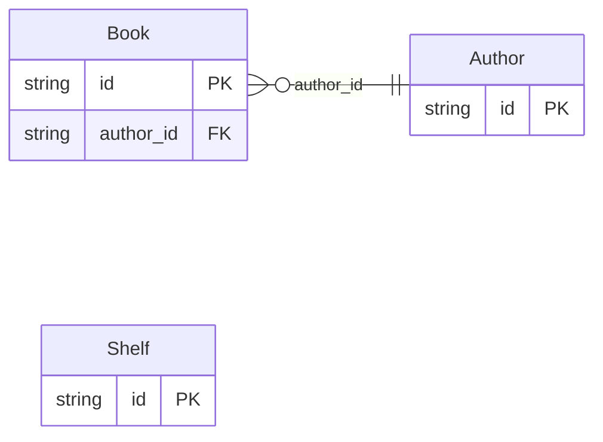

<!-- Code generated by protoc-gen-protorm. DO NOT EDIT. -->

# `bookstore_db` — GORM models

Go structs with GORM struct tags — one package per schema.

Generated from Protobuf by protoc-gen-protorm. Source of truth is the `.proto` files — regenerate rather than editing.

| Models | Enums |
| ---: | ---: |
| 3 | 1 |

## Entity relationships

## Output

- `<schema>/models.go` — one Go package per schema, one struct per table.
- `migrate.go` — a factory `Registry` (with a preloaded `Default`) that migrates every model in one call; emitted when the `go_module` opt is set.
- Nullable columns are pointer types; proto enums become string-typed Go enums.
- Attach in main: `Default.Migrate(db)`, or wire the structs into a `*gorm.DB` and run AutoMigrate yourself.

## Schema `bookstore_v1`

### `Author` → `authors`

Author is a top-level resource. Inferred table: bookstore_v1.authors. id: ID_STRATEGY_ULID synthesizes a generated `id` PK and demotes the AIP resource name to a UNIQUE lookup column; timestamps adds created_at/updated_at.

| Column | Type | Null |
| --- | --- | --- |
| `id` | `CHAR(26)` | not null |
| `name` | `VARCHAR(255)` | not null |
| `display_name` | `VARCHAR(255)` | not null |
| `bio` | `TEXT` | nullable |
| `created_at` | `TIMESTAMPTZ` | not null |
| `updated_at` | `TIMESTAMPTZ` | not null |

### `Book` → `books`

Book is a resource nested under Author. Inferred table: bookstore_v1.books.

| Column | Type | Null |
| --- | --- | --- |
| `id` | `CHAR(26)` | not null |
| `name` | `VARCHAR(255)` | not null |
| `title` | `VARCHAR(500)` | not null |
| `author_id` | `CHAR(26)` | not null |
| `isbn` | `VARCHAR(13)` | nullable |
| `published_year` | `INTEGER` | nullable |
| `genre` | `Genre` | not null |
| `create_time` | `TIMESTAMPTZ` | not null |

### Enums

- `Genre`: FICTION, NON_FICTION, SCI_FI, FANTASY

## Schema `inventory`

### `Shelf` → `shelves`

Shelf groups books physically. The resource's `plural` fixes the irregular plural ("shelfs" → "shelves") — no table name override needed.

| Column | Type | Null |
| --- | --- | --- |
| `id` | `CHAR(26)` | not null |
| `name` | `VARCHAR(255)` | not null |
| `theme` | `VARCHAR(255)` | not null |
| `capacity` | `INTEGER` | nullable |
| `created_at` | `TIMESTAMPTZ` | not null |
| `updated_at` | `TIMESTAMPTZ` | not null |
