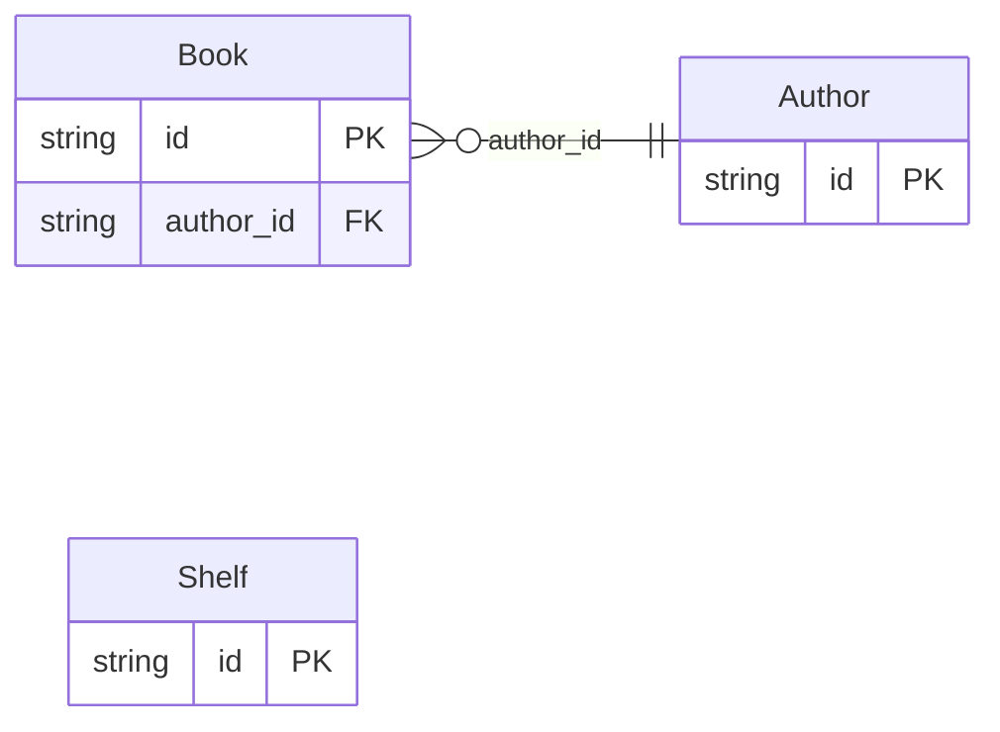

<!-- Code generated by protoc-gen-protorm. DO NOT EDIT. -->

# `bookstore_db/` — Prisma schema

Generated from Protobuf by protoc-gen-protorm. Source of truth is the `.proto` files — regenerate rather than editing.

| Models | Enums |
| ---: | ---: |
| 3 | 1 |

## Entity relationships

## Subfolders

- [`bookstore/`](./bookstore/README.md)
- [`inventory/`](./inventory/README.md)
