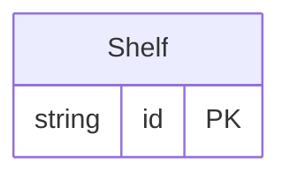

<!-- Code generated by protoc-gen-protorm. DO NOT EDIT. -->

# `bookstore_db/inventory/` — Prisma schema

Generated from Protobuf by protoc-gen-protorm. Source of truth is the `.proto` files — regenerate rather than editing.

| Models | Enums |
| ---: | ---: |
| 1 | 0 |

## Entity relationships

Schema file: [`inventory.postgres.prisma`](./inventory.postgres.prisma)

### `Shelf` → `shelves`

Shelf groups books physically. The resource's `plural` fixes the irregular plural ("shelfs" → "shelves") — no table name override needed.

| Column | Type | Null |
| --- | --- | --- |
| `id` | `CHAR(26)` | not null |
| `name` | `VARCHAR(255)` | not null |
| `theme` | `VARCHAR(255)` | not null |
| `capacity` | `INTEGER` | nullable |
| `created_at` | `TIMESTAMPTZ` | not null |
| `updated_at` | `TIMESTAMPTZ` | not null |
