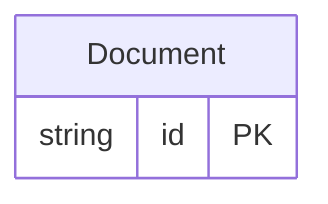

<!-- Code generated by protoc-gen-protorm. DO NOT EDIT. -->

# `v1` — Schema manifest (CSV)

A flat, one-row-per-column manifest — feed to doc tooling or a document-store setup script.

Generated from Protobuf by protoc-gen-protorm. Source of truth is the `.proto` files — regenerate rather than editing.

| Models | Enums |
| ---: | ---: |
| 1 | 0 |

## Entity relationships

## Output

- `schema.csv` — header: database, schema, table, column, sql_type, not_null, primary_key, unique, default, description.
- Enum columns report their type as `enum:<name>`; one row is emitted per column across every schema.

## Schema `aip_v1`

### `Document` → `documents`

Document exercises the AIP-148/164 system fields: create_time/update_time become auto-managed audit timestamps, delete_time a nullable indexed soft-delete marker, and uid a UNIQUE server-assigned id — all with no protorm annotation.

| Column | Type | Null |
| --- | --- | --- |
| `id` | `CHAR(26)` | not null |
| `name` | `VARCHAR(255)` | not null |
| `uid` | `VARCHAR(255)` | nullable |
| `title` | `VARCHAR(255)` | not null |
| `create_time` | `TIMESTAMPTZ` | not null |
| `update_time` | `TIMESTAMPTZ` | not null |
| `delete_time` | `TIMESTAMPTZ` | nullable |
