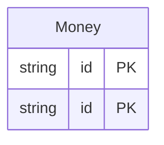

<!-- Code generated by protoc-gen-protorm. DO NOT EDIT. -->

# `commerce` — Schema manifest (CSV)

A flat, one-row-per-column manifest — feed to doc tooling or a document-store setup script.

Generated from Protobuf by protoc-gen-protorm. Source of truth is the `.proto` files — regenerate rather than editing.

| Models | Enums |
| ---: | ---: |
| 2 | 2 |

## Entity relationships

## Output

- `schema.csv` — header: database, schema, table, column, sql_type, not_null, primary_key, unique, default, description.
- Enum columns report their type as `enum:<name>`; one row is emitted per column across every schema.

## Schema `shop_cart_v1`

### `Money` → `moneys`

Money is a cart-side resource. Its simple name "Money" collides with the order-side Money once both packages merge into the "commerce" database (see protorm.yaml). Prisma qualifies the colliding model names (its models share one global namespace), while the schema-namespaced targets — GORM (one package per schema), SQL, and CSV — keep the bare "Money", since the schema already disambiguates them.

| Column | Type | Null |
| --- | --- | --- |
| `id` | `CHAR(26)` | not null |
| `name` | `VARCHAR(255)` | not null |
| `amount` | `BIGINT` | not null |
| `status` | `Status` | not null |

### Enums

- `Status`: PENDING, PAID

## Schema `shop_order_v1`

### `Money` → `moneys`

Money is the order-side resource sharing the simple name "Money" with the cart-side one. See cart.proto for how each target renders the collision.

| Column | Type | Null |
| --- | --- | --- |
| `id` | `CHAR(26)` | not null |
| `name` | `VARCHAR(255)` | not null |
| `amount` | `BIGINT` | not null |
| `status` | `Status` | not null |

### Enums

- `Status`: SHIPPED, DELIVERED
