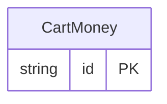

<!-- Code generated by protoc-gen-protorm. DO NOT EDIT. -->

# `commerce/cart/` — Prisma schema

Generated from Protobuf by protoc-gen-protorm. Source of truth is the `.proto` files — regenerate rather than editing.

| Models | Enums |
| ---: | ---: |
| 1 | 1 |

## Entity relationships

Schema file: [`cart.postgres.prisma`](./cart.postgres.prisma)

### `CartMoney` → `moneys`

Money is a cart-side resource. Its simple name "Money" collides with the order-side Money once both packages merge into the "commerce" database (see protorm.yaml). Prisma qualifies the colliding model names (its models share one global namespace), while the schema-namespaced targets — GORM (one package per schema), SQL, and CSV — keep the bare "Money", since the schema already disambiguates them.

| Column | Type | Null |
| --- | --- | --- |
| `id` | `CHAR(26)` | not null |
| `name` | `VARCHAR(255)` | not null |
| `amount` | `BIGINT` | not null |
| `status` | `CartStatus` | not null |

### Enums

- `CartStatus`: PENDING, PAID
