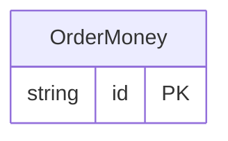

<!-- Code generated by protoc-gen-protorm. DO NOT EDIT. -->

# `commerce/order/` — Prisma schema

Generated from Protobuf by protoc-gen-protorm. Source of truth is the `.proto` files — regenerate rather than editing.

| Models | Enums |
| ---: | ---: |
| 1 | 1 |

## Entity relationships

Schema file: [`order.postgres.prisma`](./order.postgres.prisma)

### `OrderMoney` → `moneys`

Money is the order-side resource sharing the simple name "Money" with the cart-side one. See cart.proto for how each target renders the collision.

| Column | Type | Null |
| --- | --- | --- |
| `id` | `CHAR(26)` | not null |
| `name` | `VARCHAR(255)` | not null |
| `amount` | `BIGINT` | not null |
| `status` | `OrderStatus` | not null |

### Enums

- `OrderStatus`: SHIPPED, DELIVERED
