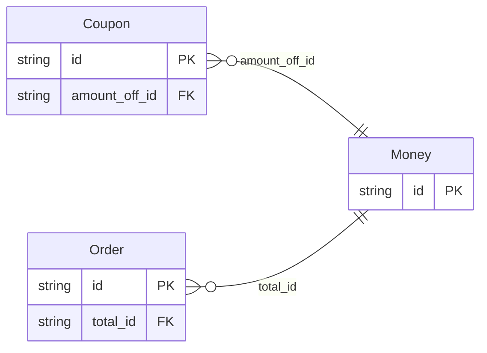

<!-- Code generated by protoc-gen-protorm. DO NOT EDIT. -->

# `shop_db` — GORM models

Go structs with GORM struct tags — one package per schema.

Generated from Protobuf by protoc-gen-protorm. Source of truth is the `.proto` files — regenerate rather than editing.

| Models | Enums |
| ---: | ---: |
| 3 | 0 |

## Entity relationships

## Output

- `<schema>/models.go` — one Go package per schema, one struct per table.
- `migrate.go` — a factory `Registry` (with a preloaded `Default`) that migrates every model in one call; emitted when the `go_module` opt is set. Call `Default.EnsureSchemas(db)` before `Default.Migrate(db)` so the schema-qualified tables have their Postgres schemas.
- Nullable columns are pointer types; proto enums become string-typed Go enums.
- Attach in main: `Default.EnsureSchemas(db)` then `Default.Migrate(db)`, or wire the structs into a `*gorm.DB` and run AutoMigrate yourself.
- `Registry.Instrument(db)` in `migrate.go` — installs the OpenTelemetry GORM tracing plugin; on by default (set the `otel` opt false to omit), emitted with `go_module`. Requires `gorm.io/plugin/opentelemetry`.

## Schema `ordering`

### `Order` → `orders`

Order is a resource in the ordering schema; it embeds Money as its total.

| Column | Type | Null |
| --- | --- | --- |
| `id` | `CHAR(26)` | not null |
| `name` | `VARCHAR(255)` | not null |
| `total_id` | `CHAR(26)` | not null |

### `Money` → `moneys`

Money is a shared value object, relationalized into ordering.moneys.

| Column | Type | Null |
| --- | --- | --- |
| `id` | `CHAR(26)` | not null |
| `currency_code` | `VARCHAR(255)` | not null |
| `units` | `BIGINT` | nullable |

## Schema `promo`

### `Coupon` → `coupons`

Coupon is a resource in the promo schema referencing Money cross-schema.

| Column | Type | Null |
| --- | --- | --- |
| `id` | `CHAR(26)` | not null |
| `name` | `VARCHAR(255)` | not null |
| `amount_off_id` | `CHAR(26)` | nullable |
