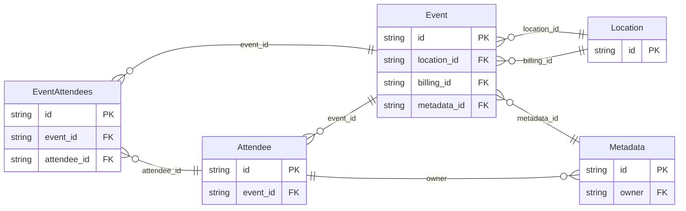

<!-- Code generated by protoc-gen-protorm. DO NOT EDIT. -->

# `v1` — PostgreSQL schema

CREATE SCHEMA / TYPE / TABLE DDL with foreign keys and indexes.

Generated from Protobuf by protoc-gen-protorm. Source of truth is the `.proto` files — regenerate rather than editing.

| Models | Enums |
| ---: | ---: |
| 5 | 0 |

## Entity relationships

## Output

- `<schema>.postgres.sql` — one DDL file per schema.
- Apply referenced tables before referencing ones, or wrap all files in a single transaction.

## Schema `embedded_v1`

### `Event` → `events`

Event exercises nested-message normalization: a singular message field becomes a belongs-to relation, a repeated message field becomes a has-many, while well-known and map fields stay scalar / JSONB.

| Column | Type | Null |
| --- | --- | --- |
| `id` | `CHAR(26)` | not null |
| `name` | `VARCHAR(255)` | not null |
| `create_time` | `TIMESTAMPTZ` | not null |
| `labels` | `JSONB` | nullable |
| `location_id` | `VARCHAR(255)` | not null |
| `billing_id` | `VARCHAR(255)` | nullable |
| `metadata_id` | `CHAR(26)` | nullable |

### `Attendee` → `attendees`

Attendee carries an IDENTIFIER, so that field is its primary key.

| Column | Type | Null |
| --- | --- | --- |
| `id` | `CHAR(26)` | not null |
| `name` | `VARCHAR(255)` | not null |
| `email` | `VARCHAR(255)` | not null |
| `event_id` | `CHAR(26)` | not null |

### `Location` → `locations`

Location is reachable from Event and so becomes its own table; its existing `id` field is promoted to the primary key.

| Column | Type | Null |
| --- | --- | --- |
| `id` | `VARCHAR(255)` | not null |
| `city` | `VARCHAR(255)` | not null |
| `venue` | `VARCHAR(255)` | nullable |

### `Metadata` → `metadatas`

Metadata is reachable only through Event.metadata and carries no resource annotation, yet it still becomes its own table (with a synthesized primary key) rather than an inlined JSONB blob.

| Column | Type | Null |
| --- | --- | --- |
| `id` | `CHAR(26)` | not null |
| `source` | `VARCHAR(255)` | nullable |
| `tags` | `VARCHAR(255)[]` | nullable |
| `owner` | `CHAR(26)` | nullable |

### `EventAttendees` → `event_attendees`

Join table for the many-to-many relation Event.attendees ↔ Attendee.

| Column | Type | Null |
| --- | --- | --- |
| `id` | `CHAR(26)` | not null |
| `event_id` | `CHAR(26)` | not null |
| `attendee_id` | `CHAR(26)` | not null |
