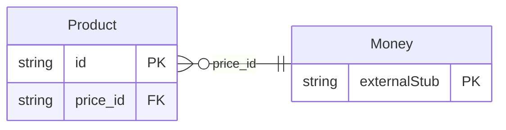

<!-- Code generated by protoc-gen-protorm. DO NOT EDIT. -->

# `external_db/external/` — Prisma schema

Generated from Protobuf by protoc-gen-protorm. Source of truth is the `.proto` files — regenerate rather than editing.

| Models | Enums |
| ---: | ---: |
| 1 | 0 |

## Entity relationships

Schema file: [`external.postgres.prisma`](./external.postgres.prisma)

### `Product` → `products`

Product owns a price expressed as an imported Money value type.

| Column | Type | Null |
| --- | --- | --- |
| `id` | `CHAR(26)` | not null |
| `name` | `VARCHAR(255)` | not null |
| `title` | `VARCHAR(255)` | not null |
| `price_id` | `CHAR(26)` | not null |
