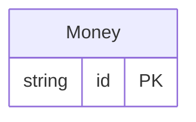

<!-- Code generated by protoc-gen-protorm. DO NOT EDIT. -->

# `external_db/money/` — Prisma schema

Generated from Protobuf by protoc-gen-protorm. Source of truth is the `.proto` files — regenerate rather than editing.

| Models | Enums |
| ---: | ---: |
| 1 | 0 |

## Entity relationships

Schema file: [`money.postgres.prisma`](./money.postgres.prisma)

### `Money` → `moneys`

Money is an amount of money with its currency type.

| Column | Type | Null |
| --- | --- | --- |
| `id` | `CHAR(26)` | not null |
| `currency_code` | `VARCHAR(255)` | nullable |
| `units` | `BIGINT` | nullable |
| `nanos` | `INTEGER` | nullable |
