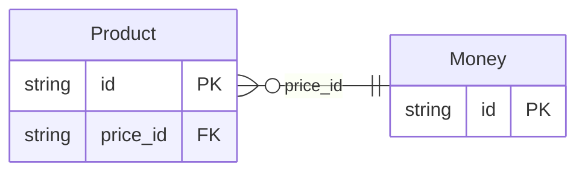

<!-- Code generated by protoc-gen-protorm. DO NOT EDIT. -->

# `external_db` — PostgreSQL schema

CREATE SCHEMA / TYPE / TABLE DDL with foreign keys and indexes.

Generated from Protobuf by protoc-gen-protorm. Source of truth is the `.proto` files — regenerate rather than editing.

| Models | Enums |
| ---: | ---: |
| 2 | 0 |

## Entity relationships

## Output

- `migrate.sql` — the whole database in one transactional file; apply with `psql -f migrate.sql`.
- `<schema>.postgres.sql` — one DDL file per schema (apply referenced tables before referencing ones).
- Auto-update triggers keep updated-at columns current; COMMENT ON persists field docs to the catalog.

## Schema `external_v1`

### `Product` → `products`

Product owns a price expressed as an imported Money value type.

| Column | Type | Null |
| --- | --- | --- |
| `id` | `CHAR(26)` | not null |
| `name` | `VARCHAR(255)` | not null |
| `title` | `VARCHAR(255)` | not null |
| `price_id` | `CHAR(26)` | not null |

### `Money` → `moneys`

Money is an amount of money with its currency type.

| Column | Type | Null |
| --- | --- | --- |
| `id` | `CHAR(26)` | not null |
| `currency_code` | `VARCHAR(255)` | nullable |
| `units` | `BIGINT` | nullable |
| `nanos` | `INTEGER` | nullable |
