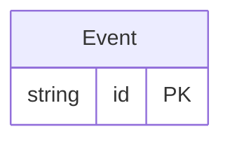

<!-- Code generated by protoc-gen-protorm. DO NOT EDIT. -->

# `users` — GORM models

Go structs with GORM struct tags — one package per schema.

Generated from Protobuf by protoc-gen-protorm. Source of truth is the `.proto` files — regenerate rather than editing.

| Models | Enums |
| ---: | ---: |
| 1 | 0 |

## Entity relationships

## Output

- `<schema>/models.go` — one Go package per schema, one struct per table.
- Nullable columns are pointer types; proto enums become string-typed Go enums.
- Wire the structs into a `*gorm.DB`; run AutoMigrate, or apply the SQL target's DDL.

## Schema `calendar_app`

### `Event` → `events`

Event is a calendar app resource. The layout config routes it to the "users" database, schema "calendar_app".

| Column | Type | Null |
| --- | --- | --- |
| `id` | `CHAR(26)` | not null |
| `name` | `VARCHAR(255)` | not null |
| `title` | `VARCHAR(255)` | not null |
