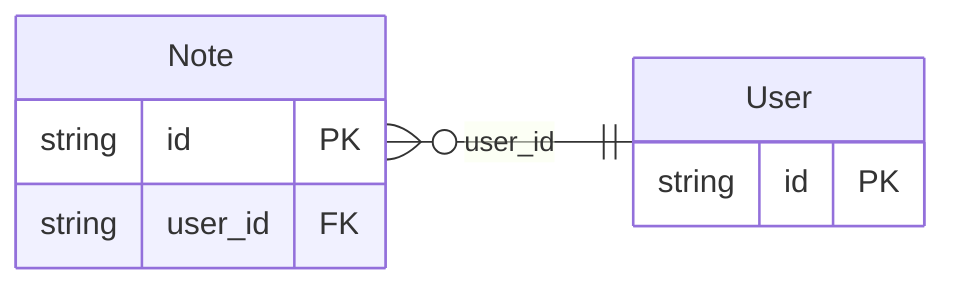

<!-- Code generated by protoc-gen-protorm. DO NOT EDIT. -->

# `v1` — GORM models

Go structs with GORM struct tags — one package per schema.

Generated from Protobuf by protoc-gen-protorm. Source of truth is the `.proto` files — regenerate rather than editing.

| Models | Enums |
| ---: | ---: |
| 2 | 0 |

## Entity relationships

## Output

- `<schema>/models.go` — one Go package per schema, one struct per table.
- `migrate.go` — a factory `Registry` (with a preloaded `Default`) that migrates every model in one call; emitted when the `go_module` opt is set.
- Nullable columns are pointer types; proto enums become string-typed Go enums.
- Attach in main: `Default.Migrate(db)`, or wire the structs into a `*gorm.DB` and run AutoMigrate yourself.

## Schema `parentref_v1`

### `User` → `users`

User is the parent resource.

| Column | Type | Null |
| --- | --- | --- |
| `id` | `CHAR(26)` | not null |
| `name` | `VARCHAR(255)` | not null |
| `display_name` | `VARCHAR(255)` | not null |

### `Note` → `notes`

Note is owned by a User. Its pattern carries a {user} parent segment with no corresponding field, so protorm materializes a user_id FK → User from the pattern alone.

| Column | Type | Null |
| --- | --- | --- |
| `id` | `CHAR(26)` | not null |
| `name` | `VARCHAR(255)` | not null |
| `body` | `VARCHAR(255)` | not null |
| `user_id` | `CHAR(26)` | not null |
