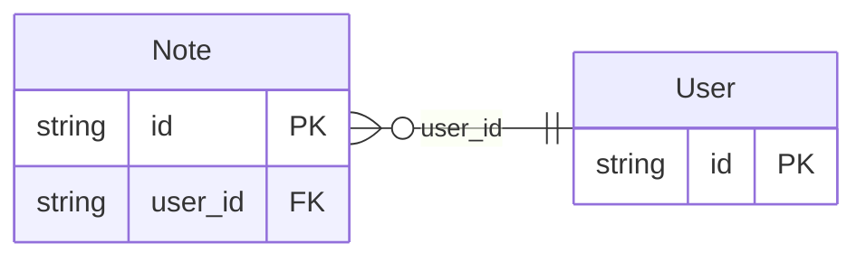

<!-- Code generated by protoc-gen-protorm. DO NOT EDIT. -->

# `v1` — PostgreSQL schema

CREATE SCHEMA / TYPE / TABLE DDL with foreign keys and indexes.

Generated from Protobuf by protoc-gen-protorm. Source of truth is the `.proto` files — regenerate rather than editing.

| Models | Enums |
| ---: | ---: |
| 2 | 0 |

## Entity relationships

## Output

- `migrate.sql` — the whole database in one transactional file; apply with `psql -f migrate.sql`.
- `<schema>.postgres.sql` — one DDL file per schema (apply referenced tables before referencing ones).
- Auto-update triggers keep updated-at columns current; COMMENT ON persists field docs to the catalog.

## Schema `parentref_v1`

### `User` → `users`

User is the parent resource.

| Column | Type | Null |
| --- | --- | --- |
| `id` | `CHAR(26)` | not null |
| `name` | `VARCHAR(255)` | not null |
| `display_name` | `VARCHAR(255)` | not null |

### `Note` → `notes`

Note is owned by a User. Its pattern carries a {user} parent segment with no corresponding field, so protorm materializes a user_id FK → User from the pattern alone.

| Column | Type | Null |
| --- | --- | --- |
| `id` | `CHAR(26)` | not null |
| `name` | `VARCHAR(255)` | not null |
| `body` | `VARCHAR(255)` | not null |
| `user_id` | `CHAR(26)` | not null |
