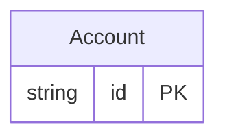

<!-- Code generated by protoc-gen-protorm. DO NOT EDIT. -->

# `reserved_db` — GORM models

Go structs with GORM struct tags — one package per schema.

Generated from Protobuf by protoc-gen-protorm. Source of truth is the `.proto` files — regenerate rather than editing.

| Models | Enums |
| ---: | ---: |
| 1 | 1 |

## Entity relationships

## Output

- `<schema>/models.go` — one Go package per schema, one struct per table.
- `migrate.go` — a factory `Registry` (with a preloaded `Default`) that migrates every model in one call; emitted when the `go_module` opt is set.
- Nullable columns are pointer types; proto enums become string-typed Go enums.
- Attach in main: `Default.Migrate(db)`, or wire the structs into a `*gorm.DB` and run AutoMigrate yourself.

## Schema `public`

### `Account` → `user`

Account is forced onto the reserved table name "user" via a table override, with reserved-word columns and a composite UNIQUE index over them.

| Column | Type | Null |
| --- | --- | --- |
| `id` | `CHAR(26)` | not null |
| `name` | `VARCHAR(255)` | not null |
| `order` | `VARCHAR(255)` | nullable |
| `select` | `VARCHAR(255)` | nullable |
| `state` | `State` | nullable |

### Enums

- `State`: ACTIVE, CLOSED
