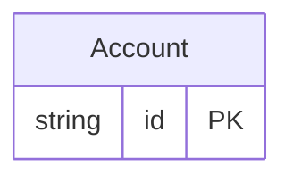

<!-- Code generated by protoc-gen-protorm. DO NOT EDIT. -->

# `reserved_db` — PostgreSQL schema

CREATE SCHEMA / TYPE / TABLE DDL with foreign keys and indexes.

Generated from Protobuf by protoc-gen-protorm. Source of truth is the `.proto` files — regenerate rather than editing.

| Models | Enums |
| ---: | ---: |
| 1 | 1 |

## Entity relationships

## Output

- `migrate.sql` — the whole database in one transactional file; apply with `psql -f migrate.sql`.
- `<schema>.postgres.sql` — one DDL file per schema (apply referenced tables before referencing ones).
- Auto-update triggers keep updated-at columns current; COMMENT ON persists field docs to the catalog.

## Schema `public`

### `Account` → `user`

Account is forced onto the reserved table name "user" via a table override, with reserved-word columns and a composite UNIQUE index over them.

| Column | Type | Null |
| --- | --- | --- |
| `id` | `CHAR(26)` | not null |
| `name` | `VARCHAR(255)` | not null |
| `order` | `VARCHAR(255)` | nullable |
| `select` | `VARCHAR(255)` | nullable |
| `state` | `State` | nullable |

### Enums

- `State`: ACTIVE, CLOSED
