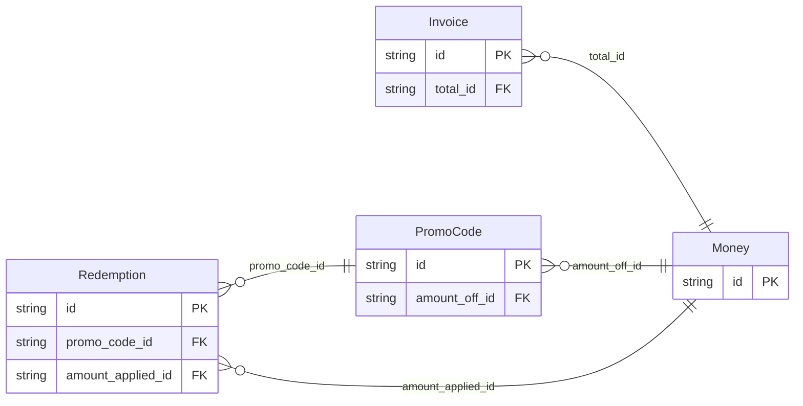

<!-- Code generated by protoc-gen-protorm. DO NOT EDIT. -->

# `freebusy_db` — GORM models

Go structs with GORM struct tags — one package per schema.

Generated from Protobuf by protoc-gen-protorm. Source of truth is the `.proto` files — regenerate rather than editing.

| Models | Enums |
| ---: | ---: |
| 4 | 0 |

## Entity relationships

## Output

- `<schema>/models.go` — one Go package per schema, one struct per table.
- `migrate.go` — a factory `Registry` (with a preloaded `Default`) that migrates every model in one call; emitted when the `go_module` opt is set. Call `Default.EnsureSchemas(db)` before `Default.Migrate(db)` so the schema-qualified tables have their Postgres schemas.
- Nullable columns are pointer types; proto enums become string-typed Go enums.
- Attach in main: `Default.EnsureSchemas(db)` then `Default.Migrate(db)`, or wire the structs into a `*gorm.DB` and run AutoMigrate yourself.
- `Registry.Instrument(db)` in `migrate.go` — installs the OpenTelemetry GORM tracing plugin; on by default (set the `otel` opt false to omit), emitted with `go_module`. Requires `gorm.io/plugin/opentelemetry`.

## Schema `promocode`

### `PromoCode` → `promo_codes`

PromoCode is a redeemable discount with a has-many set of redemptions.

| Column | Type | Null |
| --- | --- | --- |
| `id` | `CHAR(26)` | not null |
| `name` | `VARCHAR(255)` | not null |
| `amount_off_id` | `CHAR(26)` | nullable |

### `Redemption` → `redemptions`

Redemption is one use of a promo code. As a repeated nested message it materializes into promocode.redemptions; its own Money field routes to the shared common.moneys, one schema level down from the parent.

| Column | Type | Null |
| --- | --- | --- |
| `id` | `CHAR(26)` | not null |
| `customer` | `VARCHAR(255)` | not null |
| `redeemed_time` | `TIMESTAMPTZ` | not null |
| `promo_code_id` | `CHAR(26)` | not null |
| `amount_applied_id` | `CHAR(26)` | not null |

## Schema `billing`

### `Invoice` → `invoices`

Invoice carries a total expressed as the shared Money value object.

| Column | Type | Null |
| --- | --- | --- |
| `id` | `CHAR(26)` | not null |
| `name` | `VARCHAR(255)` | not null |
| `total_id` | `CHAR(26)` | not null |

## Schema `common`

### `Money` → `moneys`

Money is an amount of money with its currency type.

| Column | Type | Null |
| --- | --- | --- |
| `id` | `CHAR(26)` | not null |
| `currency_code` | `VARCHAR(255)` | nullable |
| `units` | `BIGINT` | nullable |
| `nanos` | `INTEGER` | nullable |
