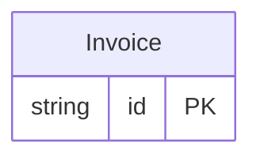

<!-- Code generated by protoc-gen-protorm. DO NOT EDIT. -->

# `billing_db` — Schema manifest (CSV)

A flat, one-row-per-column manifest — feed to doc tooling or a document-store setup script.

Generated from Protobuf by protoc-gen-protorm. Source of truth is the `.proto` files — regenerate rather than editing.

| Models | Enums |
| ---: | ---: |
| 1 | 0 |

## Entity relationships

## Output

- `schema.csv` — header: database, schema, table, column, sql_type, not_null, primary_key, unique, default, description.
- Enum columns report their type as `enum:<name>`; one row is emitted per column across every schema.

## Schema `acme_billing`

### `Invoice` → `invoices`

Invoice lands in schema "acme_billing", not "acme_billing_v1": the protorm.yaml strip_version option flattens the trailing API version out of the resource-type-derived schema name.

| Column | Type | Null |
| --- | --- | --- |
| `id` | `CHAR(26)` | not null |
| `name` | `VARCHAR(255)` | not null |
| `amount` | `VARCHAR(255)` | not null |
