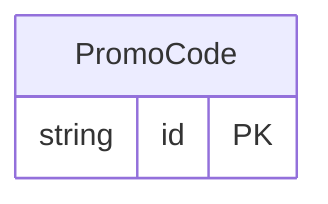

<!-- Code generated by protoc-gen-protorm. DO NOT EDIT. -->

# `promo_db` — GORM models

Go structs with GORM struct tags — one package per schema.

Generated from Protobuf by protoc-gen-protorm. Source of truth is the `.proto` files — regenerate rather than editing.

| Models | Enums |
| ---: | ---: |
| 1 | 0 |

## Entity relationships

## Output

- `<schema>/models.go` — one Go package per schema, one struct per table.
- `migrate.go` — a factory `Registry` (with a preloaded `Default`) that migrates every model in one call; emitted when the `go_module` opt is set. Call `Default.EnsureSchemas(db)` before `Default.Migrate(db)` so the schema-qualified tables have their Postgres schemas.
- Nullable columns are pointer types; proto enums become string-typed Go enums.
- Attach in main: `Default.EnsureSchemas(db)` then `Default.Migrate(db)`, or wire the structs into a `*gorm.DB` and run AutoMigrate yourself.
- `<schema>/<model>_store.go` — a typed CRUD store per resource (Create, GetByID, List, Count, Update, DeleteByID, plus GetBy/ListBy finders for unique and foreign-key columns); emitted when the `stores` opt is set (which also requires `go_module`). Requires `gorm.io/gorm`.
- `gormx/gormx.go` — the shared runtime every store imports: `ListOptions`, the generic `Store[M]` interface every store satisfies, a `GenericStore[M]` engine that runs CRUD for any model with no per-entity code, and `EnsureSchemas`. Lets one generic engine drive every entity.
- `Registry.Instrument(db)` in `migrate.go` — installs the OpenTelemetry GORM tracing plugin; on by default (set the `otel` opt false to omit), emitted with `go_module`. Requires `gorm.io/plugin/opentelemetry`.

## Schema `promo`

### `PromoCode` → `promo_codes`

PromoCode is a redeemable promotion. The human-facing `code` is unique via a single-column unique index, so protorm emits GetByCode alongside GetByID and the GetByName finder for the AIP resource name.

| Column | Type | Null |
| --- | --- | --- |
| `id` | `CHAR(26)` | not null |
| `name` | `VARCHAR(255)` | not null |
| `code` | `VARCHAR(255)` | not null |
| `description` | `VARCHAR(255)` | nullable |
