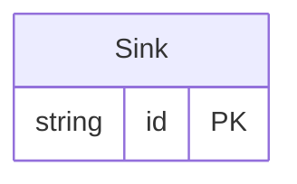

<!-- Code generated by protoc-gen-protorm. DO NOT EDIT. -->

# `wkt_db` — GORM models

Go structs with GORM struct tags — one package per schema.

Generated from Protobuf by protoc-gen-protorm. Source of truth is the `.proto` files — regenerate rather than editing.

| Models | Enums |
| ---: | ---: |
| 1 | 0 |

## Entity relationships

## Output

- `<schema>/models.go` — one Go package per schema, one struct per table.
- `migrate.go` — a factory `Registry` (with a preloaded `Default`) that migrates every model in one call; emitted when the `go_module` opt is set. Call `Default.EnsureSchemas(db)` before `Default.Migrate(db)` so the schema-qualified tables have their Postgres schemas.
- Nullable columns are pointer types; proto enums become string-typed Go enums.
- Attach in main: `Default.EnsureSchemas(db)` then `Default.Migrate(db)`, or wire the structs into a `*gorm.DB` and run AutoMigrate yourself.
- `Registry.Instrument(db)` in `migrate.go` — installs the OpenTelemetry GORM tracing plugin; on by default (set the `otel` opt false to omit), emitted with `go_module`. Requires `gorm.io/plugin/opentelemetry`.

## Schema `kitchen`

### `Sink` → `sinks`

Sink is one table holding every interesting type mapping.

| Column | Type | Null |
| --- | --- | --- |
| `id` | `CHAR(26)` | not null |
| `name` | `VARCHAR(255)` | not null |
| `flag` | `BOOLEAN` | nullable |
| `count32` | `INTEGER` | nullable |
| `count64` | `BIGINT` | nullable |
| `ratio` | `REAL` | nullable |
| `precise` | `DOUBLE PRECISION` | nullable |
| `blob` | `BYTEA` | nullable |
| `event_time` | `TIMESTAMPTZ` | nullable |
| `window` | `INTERVAL` | nullable |
| `mask` | `TEXT` | nullable |
| `maybe_count` | `BIGINT` | nullable |
| `maybe_label` | `VARCHAR(255)` | nullable |
| `tags` | `VARCHAR(255)[]` | nullable |
| `scores` | `INTEGER[]` | nullable |
| `attributes` | `JSONB` | nullable |
